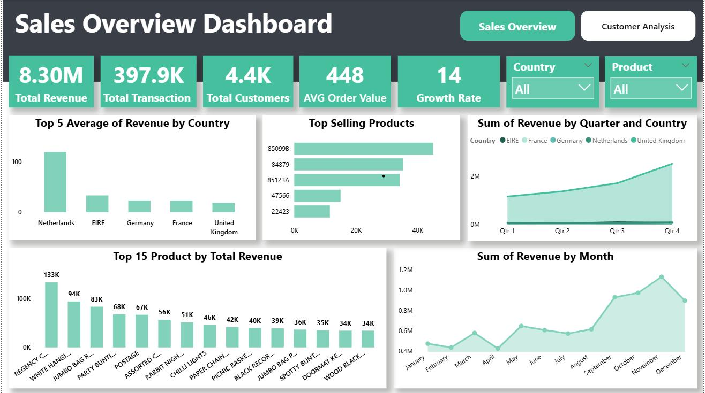

## Dashboard Screenshot

# Sales Performance Dashboard

## Project Overview

This Power BI dashboard analyzes sales, profit, orders and regional performance.

## Tools Used

- Power BI
- Excel
- DAX
- Power Query

## KPIs

- Total Sales
- Total Profit
- Total Orders
- Profit Margin

## Key Insights

- West region generated highest profit.
- Technology category generated highest sales.
- Q4 showed highest growth.

## Author

Mohit Kasana
